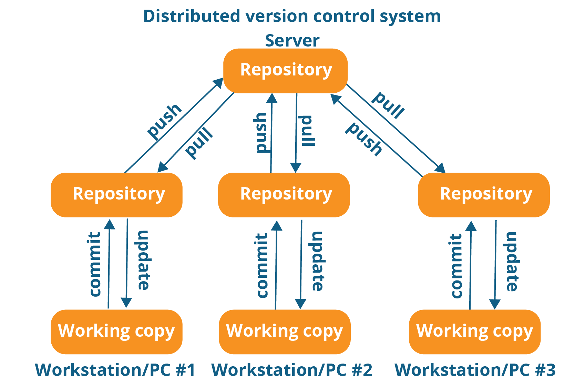

# Hands on Learning of Git and Github
Date: 14th October 2023

Speaker: [@sahilyeole](https://github.com/sahilyeole)

Event page (register here): https://gdsc.community.dev/events/details/developer-student-clubs-g-h-raisoni-institute-of-engineering-and-technology-presents-hands-on-learning-of-git-and-github/
## Topics to be covered
- [Setting up git and github](https://github.com/gdsc-ghrietn/git-github#setting-up-git-and-github)
- [Basic terminal commands for navigation](https://github.com/gdsc-ghrietn/git-github#basic-terminal-commands-for-navigation)
- [What is version control system?](https://github.com/gdsc-ghrietn/git-github#what-is-version-control-system)
- [Creating & cloning a repository](https://github.com/gdsc-ghrietn/git-github#creating--cloning-a-repository)
- [Making changes](https://github.com/gdsc-ghrietn/git-github#making-changes)
- [Pushing changes to github ](https://github.com/gdsc-ghrietn/git-github#pushing-changes-to-github)
- [Git branches and merging](https://github.com/gdsc-ghrietn/git-github#git-branches-and-merging)
- [Creating a pull request](https://github.com/gdsc-ghrietn/git-github#creating-a-pull-request)
- [Making your first open source contribution [Activity]](https://github.com/gdsc-ghrietn/git-github#making-your-first-open-source-contribution-activity)

#### BONUS
- [Resolving merge conflicts](https://github.com/gdsc-ghrietn/git-github#resolving-merge-conflicts)
- [VS code integration with git](https://github.com/gdsc-ghrietn/git-github#vs-code-integration-with-git)

---
## Setting up git and github
- Creating github account: https://github.com/signup
- Downloading git: https://git-scm.com/downloads
- Installing git (guide): https://phoenixnap.com/kb/how-to-install-git-windows

  Note: In that guide, ignore `How to Launch Git in Windows` and later.
- Make sure `git -v` command works in your terminal. If it doesn't, there might be some problem with the installation or in setting up the path. Try reinstalling git and make sure to follow the guide properly.

---
## Basic terminal commands for navigation
**NOTE:** For Windows users, use `Git Bash` for running the commands. It comes with the git installation. For this session, we will be using `Git Bash` for running the commands.
- 
1. `pwd` (Print Working Directory): Displays the current directory path.

   Example:
   ```bash
   $ pwd
   /home/user/documents
    ```
2. `cd` (Change Directory):
    - To move forward (into a subdirectory):
      ```bash
      $ cd directory_name
      ```
    - To move backward (up one directory):
      ```bash
      $ cd ..
      ```
    - To move up two directories:
      ```bash
      $ cd ../..
      ```

3. `ls` (List): Lists the files and directories in the current directory.

    Example:
    ```bash
   $ ls
    file1.txt file2.txt directory1 directory2
    ```
---
## What is version control system?
- Version control systems are software tools that help software teams manage changes to source code over time.
- Version control systems help software teams work faster and smarter.

- The types of VCS are:
    1. Local Version Control System
    2. Centralized Version Control System
    3. Distributed Version Control System
- Git is the most well-known example of distributed version control systems.

---

## Creating & cloning a repository
### Creating a repository
1. Open your github profile and go to `Repositories` tab.
2. Click on `New` button.

3. Give a name to your repositor.
4. Make sure to check `Add a README file` option.
5. Click on `Create repository` button.


### Cloning a repository
1. After creating a repository you will be redirected to the repository page. Or else you can access it from Repositories tab in your profile.
2. Click on `Code` button.
3. Copy the https link of your repository.

4. Open your bash terminal and `cd` into your desired location (for me Developer folder).
```bash
$ cd Developer
```
5. Open your bash terminal and enter `git clone [your repo link]`
```bash
git clone https://github.com/sahilyeole/Test.git  
```
6. Now in your file manager you can see a new folder created with the name of your repository. You can also see this using `ls` command.


7. `cd` into that folder in terminal.
```bash
$ cd Test
```
8. `ls` to see the files in that folder.
```bash
$ ls
README.md
```
It will show only README.md file as we have not added any other file yet.

Congrats you have successfully cloned your first repository.

---

## Making changes
1. Open the README.md file in your favorite text editor. (Ex: VS code or notepad)
I'm vim user so I will use vim to open the file.

```bash
nvim README.md
```
2. Add some text to the file and save it.
```
Hello world
```


3. Now go to your terminal and type `git status` command.
```bash
$ git status
```

`git status` gives the current status of the repository. It shows that README.md file is modified. And it says changes not staged for commit. It means that the changes are not yet added to the staging area.

---
## Pushing changes to github
1. Now we will add our modified file to the staging area using `git add` command.
```bash
$ git add README.md
```
Staging area is a place where we add the files which are ready to be committed. We can add multiple files to the staging area and commit them all at once.

Or if you want to stage all the files in the current directory of the repository then you can use `git add .` command.
```bash
$ git add .
```
**Note:**

  `.` represents the current directory.

  You can also restore the changes you have made to the file using `git restore` command.
  (You can ignore this command for now if you dont want to restore the changes.)
  ```bash
  $ git restore README.md
  ```
2. Enter `git status` command again to see the status of the repository.
```bash
$ git status
```

 Now it says "Changes to be committed". It means that the changes are added to the staging area and are ready to be committed.

 At this point you can verify your changes by using `git diff` command.
 ```bash
  $ git diff
  ```

3. Now we will commit the changes using `git commit` command.

Commit is like a snapshot of the changes you have made. If we want to push the changes to github then we have to commit them first.

```bash
$ git commit -m "Added hello world"
```
`-m` flag is used to add a commit message. It is a good practice to add a meaningful commit message to every commit you make. It helps you to keep track of the changes you have made.

4. Try `git status` command again.
```bash
$ git status
```


Now it doesn't show any changes. It means that the changes are committed successfully.
We can verify this by using `git log` command.
```bash
$ git log
```
git log shows the history of commits made to the repository. It shows the commit hash, author, date and commit message.

### Note: Press `q` to exit from the log.
5. We aren't done yet because these commits are currently stored only in our local machine. We have to push these commits to github so that everyone can see them.

We will use `git push` command to push the commits to github.
```bash
$ git push origin main
```
here origin is referring to the remote repository and main is the branch name.

Or you can also use 
```bash
$ git push origin head
```
This will push to the current branch (head) you are on to the remote repository. In this case our head branch is main.

You can verify `head` branch here or even using  `git status` command.


6. After 5th step your commits are pushed to github. You can verify this by going to your repository page on github.


---

### Summary of what we did so far


## Git branches and merging
Git branches are parallel versions of a codebase that allow developers to work on different features or fixes without impacting the main code.
1. `git branch` to list all the available branches.
```bash
$ git branch
```
Currently there's only one branch named  `main`.
Press q to get out. 

2. `git branch [branch name]` to create a new branch.
```bash
$ git branch new_branch
```
now run `git branch`


now our new branch `new_branch` has been added.

Notice the `*` it represents the head of the branch, meaning what branch our current local repository is pointing to.
Currently it's on `main` branch lets switch it to `new_branch`.
3. `git switch [branch name]` to switch branches
```bash
$ git switch new_branch
```
Now our head is at `new_branch` meaning our repo is now pointing to `new_branch`
 
Also, notice prompt in our terminal is showing `new_branch`.

Also, `git status` will show this branch.
4. Now, we will do changes in this branch. The changes done in this branch are separate from other branches.
I have edited README.md here.

And now following above instructions lets add, commit and push the changes to github.
```bash
$ git add .
$ git commit -m "Update README"
$ git push origin head
```
Alternative for push command: `git push origin new_branch`.

Now our new branch has been pushed to github along with new changes.
You can verify it here.
Switch branch on github.


This new branch is having the changes we have made in this branch.

### Merging
Now lets merge our `new_branch` into `main` branch.
If branches are not protected, you can use `git merge` command to merge branches.
But first we will have to switch to `main` branch.
```bash
$ git switch main
$ git merge new_branch
```
Now our `main` branch is having changes from `new_branch`.

(Ignore bat command in this image, it is just to print the content of README.md file.)

- These new changes in `main` are only local, lets push to github.
```bash
$ git push origin main
```
Go on github to verify, switch to `main` branch and go to commits.


Notice the commit we made in `new_branch` has appeared here. Meaning the changes made in `new_branch` are successfully merged in`main`.

We can also manage branches on github by going to branches tab.


Source here means which branch to copy. When we did it locally it automatically copied the branch we had head on.

Just like changes made locally has to be pushed in order to sync Local -> Github.
We need to sync Github -> Local because we now have made changes on Github which are not in our local repo.
To do this we have to use `git pull` command.
```bash
$ git pull
```
It will sync the changes from github to local repo.


If the branches are protected then you will have to create a pull request to merge the branches. This is generally considered as a good and safe practice. Let's do that next.
## Creating a pull request
Here, I will quickly create a new branch and make some changes to it and push.
```bash
$ git branch new_branch2
$ git switch new_branch2
```
- Make some changes to README.md file.

- add, commit and push to github.
```bash
$ git add .
$ git commit -m "Update README in new_branch2"
$ git push origin head
```
Switch to  `new_branch2` on github (Refresh page if you aren't seeing new branch).


It says "1 commit ahead of main" and there's an option to Contribute, click there.

Click on "Open pull request".
(You can Compare branches without creating PR)
Now give a meaningful name to our PR.
You can also write meaningful comment to describe the changes you have made.

Before clicking "Create pull request" let's verify the changes we are going to make in the `main` branch.
So scroll down on the same page and you will see the differece between the branches.

Click on "Create pull request" and our PR will be made. You can click on Pull requests tab on your repo to check it.
Currently it is open, meaning it is not merged or closed yet.

Also, it says to no conflicts with base branch. We will see what it means soon.
Now click on "Merge pull request" and then "Confirm merge".

Now our PR is merged.
We can verify our `main` branch now.
The `new_branch2` has been successfully merged into `main`.


## Making your first open source contribution [Activity]
1. Create a fork of https://github.com/gdsc-ghrietn

A GitHub fork is a copy of a repository that allows you to freely experiment with changes without affecting the original project.

2. Clone the forked repository.
3. Create a new branch.
4. Make changes: In Contribute folder add a file with your name with .txt extension. Include your name and other details in the file.
5. Add, commit, push changes to forked repo.
6. Create a pull request.

#### BONUS
We will be showcased during the event briefly.
## Resolving merge conflicts
https://docs.github.com/en/pull-requests/collaborating-with-pull-requests/addressing-merge-conflicts/resolving-a-merge-conflict-using-the-command-line
## VS code integration with git
https://code.visualstudio.com/docs/sourcecontrol/overview